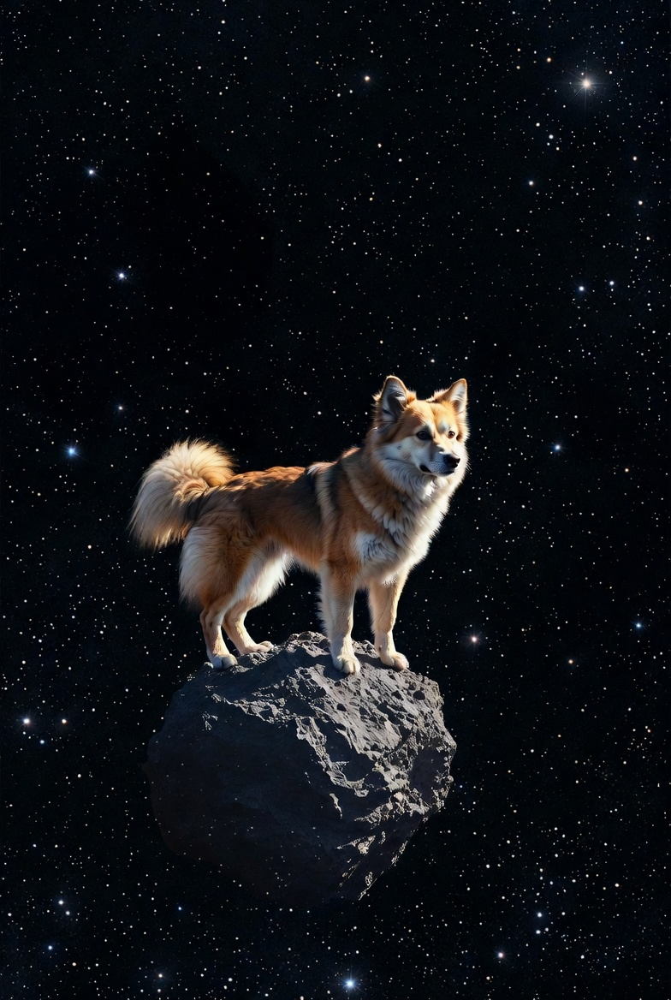

# Exercise 3: Image Generation Prompt Design

## Objective
Create prompts for image generation models, refine them with specific constraints, and compare the expected outputs between vague and descriptive prompts.

> **Note:** Image generation was simulated by describing expected outputs, as no image model interface was available. The focus of this exercise is on prompt design and understanding how constraints shape visual output.

---

## Step 1: Vague Prompt

**Prompt:**
> "A dog on an asteroid in space."

**Expected Output Description:**

A medium-sized dog standing confidently on a rugged asteroid floating in deep space. The asteroid has a rough, rocky surface with small craters and glowing mineral veins. The dog's fur gently moves as if in a subtle cosmic breeze, and it looks curiously toward the horizon. Surrounding the scene are distant stars, colorful nebula clouds, and a faint glow from a nearby planet, creating a dreamy and cinematic atmosphere. Soft dramatic lighting highlights the dog while casting long shadows across the asteroid.

> **Observation:** With no constraints provided, the image model fills in all visual decisions on its own — art style, color palette, lighting, perspective, and mood are all left to interpretation, leading to unpredictable or generic results.

---

## Step 2: Refined Prompt

**Prompt:**
> "A serene watercolor illustration of a dog standing on a rugged asteroid in space, painted in soft warm tones, captured in a wide-angle view with gentle stars and subtle cosmic light creating a calm atmosphere."

.jpg)

**Constraints Added:**

| Constraint | Value |
|---|---|
| Art Style | Watercolor illustration |
| Color Palette | Soft warm tones |
| Perspective | Wide-angle view |
| Mood | Serene and calm |
| Lighting | Subtle cosmic light |

**Expected Output Description:**

A calm, painterly watercolor scene with soft warm tones, featuring a dog standing on a textured asteroid under gentle cosmic light. The wide-angle composition captures subtle stars spread across the background, with a serene and controlled atmosphere throughout. The watercolor style gives the image soft edges and blended colors, creating a visually coherent and intentional result with no unexpected stylistic choices.

> **Observation:** With specific constraints defined, the image model is guided toward a precise visual outcome — the art style, palette, perspective, and mood are all locked in, leaving no room for unintended interpretations.

---

## Comparison Analysis

The vague prompt, "A dog on an asteroid in space," gives only the basic idea of the subject and setting, leaving almost everything about the scene up to interpretation. The refined prompt, by including art style, color palette, perspective, and mood, adds specific constraints that guide the image generator to produce a more intentional and visually coherent result. These details influence the textures, lighting, composition, and emotional tone, turning a simple concept into a distinct visual style, like a serene watercolor with warm tones and a wide-angle view. This comparison shows that effective prompt design requires balancing clarity and creativity: the more precise and descriptive the prompt, the more likely the generated image will match your intended vision. In other words, adding constraints helps control the aesthetic and mood, while vague prompts can lead to unpredictable or generic results.

---

## Summary Table

| Aspect | Vague Prompt | Refined Prompt |
|---|---|---|
| Subject | Dog on asteroid | Dog on asteroid |
| Art Style Specified | No — model decides | Yes — watercolor illustration |
| Color Palette Specified | No — model decides | Yes — soft warm tones |
| Perspective Specified | No — model decides | Yes — wide-angle view |
| Mood Specified | No — model decides | Yes — serene and calm |
| Output Predictability | Low | High |
| Visual Coherence | Unpredictable | Intentional and controlled |
